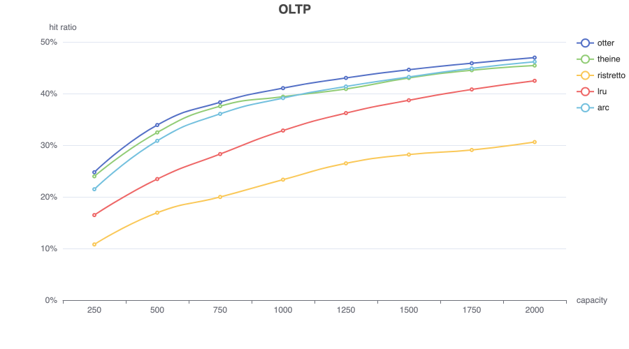

# Theine
[](https://pkg.go.dev/github.com/Yiling-J/theine-go)
[](https://codecov.io/gh/Yiling-J/theine-go)

High performance in-memory & hybrid cache inspired by [Caffeine](https://github.com/ben-manes/caffeine).


- Good performance
- Support for Generics
- High hit ratio with adaptive [W-TinyLFU](https://arxiv.org/pdf/1512.00727.pdf) eviction policy
- Expired data are removed automatically using [hierarchical timer wheel](http://www.cs.columbia.edu/~nahum/w6998/papers/ton97-timing-wheels.pdf)
- Simple API

## Table of Contents

- [Requirements](#requirements)
- [Installation](#installation)
- [API](#api)
- [Cache Persistence](#cache-persistence)
- [Benchmarks](#benchmarks)
  * [throughput](#throughput)
  * [hit ratios](#hit-ratios)
- [Hybrid Cache(Experimental)](#hybrid-cache)
- [Support](#support)

## Requirements
Go 1.19+

## Installation
```
go get github.com/Yiling-J/theine-go
```

## API

**Builder API**

Theine provides two types of client, simple cache and loading cache. Both of them are initialized from a builder. The difference between simple cache and loading cache is: loading cache's Get method will compute the value using loader function when there is a miss, while simple cache client only return false and do nothing.

Loading cache uses [singleflight](https://pkg.go.dev/golang.org/x/sync/singleflight) to prevent concurrent loading to same key(thundering herd).

simple cache:

```GO
import "github.com/Yiling-J/theine-go"

// key type string, value type string, max size 1000
// max size is the only required configuration to build a client
client, err := theine.NewBuilder[string, string](1000).Build()
if err != nil {
	panic(err)
}

// builder also provide several optional configurations
// you can chain them together and call build once
// client, err := theine.NewBuilder[string, string](1000).Cost(...).Doorkeeper(...).Build()

// or create builder first
builder := theine.NewBuilder[string, string](1000)

// dynamic cost function based on value
// use 0 in Set will call this function to evaluate cost at runtime
builder.Cost(func(v string) int64 {
		return int64(len(v))
})

// doorkeeper
// doorkeeper will drop Set if they are not in bloomfilter yet
// this can improve write performance, but may lower hit ratio
builder.Doorkeeper(true)

// removal listener, this function will be called when entry is removed
// RemoveReason could be REMOVED/EVICTED/EXPIRED
// REMOVED: remove by API
// EVICTED: evicted by Window-TinyLFU policy
// EXPIRED: expired by timing wheel
builder.RemovalListener(func(key K, value V, reason theine.RemoveReason) {})

```
loading cache:

```go
import "github.com/Yiling-J/theine-go"

// loader function: func(ctx context.Context, key K) (theine.Loaded[V], error)
// Loaded struct should include cache value, cost and ttl, which required by Set method
client, err := theine.NewBuilder[string, string](1000).Loading(
	func(ctx context.Context, key string) (theine.Loaded[string], error) {
		return theine.Loaded[string]{Value: key, Cost: 1, TTL: 0}, nil
	},
).Build()
if err != nil {
	panic(err)
}

```
Other builder options are same as simple cache(cost, doorkeeper, removal listener).


**Client API**

```Go
// set, key foo, value bar, cost 1
// success will be false if cost > max size
success := client.Set("foo", "bar", 1)
// cost 0 means using dynamic cost function
// success := client.Set("foo", "bar", 0)

// set with ttl
success = client.SetWithTTL("foo", "bar", 1, 1*time.Second)

// get(simple cache version)
value, ok := client.Get("foo")

// get(loading cache version)
value, err := client.Get(ctx, "foo")

// remove
client.Delete("foo")

// iterate key/value in cache and apply custom function
// if function returns false, range stops the iteration
client.Range(func(key, value int) bool {
	return true
})

// close client, set hashmaps in shard to nil and close all goroutines
client.Close()

```

## Cache Persistence
Theine supports persisting the cache into `io.Writer` and restoring from `io.Reader`. [Gob](https://pkg.go.dev/encoding/gob) is used to encode/decode data, so **make sure your key/value can be encoded by gob correctly first** before using this feature.

#### API
```go
func (c *Cache[K, V]) SaveCache(version uint64, writer io.Writer) error
func (c *Cache[K, V]) LoadCache(version uint64, reader io.Reader) error
```
**- Important:** please `LoadCache` immediately after client created, or existing entries' TTL might be affected.

#### Example:
```go
// save
f, err := os.Create("test")
err := client.SaveCache(0, f)
f.Close()

// load
f, err = os.Open("test")
require.Nil(t, err)
newClient, err := theine.NewBuilder[int, int](100).Build()
// load immediately after client created
err = newClient.LoadCache(0, f)
f.Close()
```
Version number must be same when saving and loading, or `LoadCache` will return `theine.VersionMismatch` error. You can change the version number when you want to ignore persisted cache.
```go
err := newClient.LoadCache(1, f)
// VersionMismatch is a global variable
if err == theine.VersionMismatch {
	// ignore and skip loading
} else if err != nil {
	// panic error
}
```

#### Details
When persisting cache, Theine roughly do:
- Store version number.
- Store clock(used in TTL).
- Store frequency sketch.
- Store entries one by one in protected LRU in most-recently:least-recently order.
- Store entries one by one in probation LRU in most-recently:least-recently order.
- Loop shards and store entries one by one in each shard deque.

When loading cache, Theine roughly do:
- Load version number, compare to current version number.
- Load clock.
- Load frequency sketch.
- Load protected LRU and insert entries back to new protected LRU and shards/timingwheel, expired entries will be ignored. Because cache capacity may change, this step will stop if max protected LRU size reached.
- Load probation LRU and insert entries back to new probation LRU and shards/timingwheel, expired entries will be ignored, Because cache capacity may change, this step will stop if max probation LRU size reached.
- Load deque entries and insert back to shards, expired entries will be ignored.

Theine will save checksum when persisting cache and verify checksum first when loading.

## Benchmarks

Source: https://github.com/maypok86/benchmarks
	
### throughput

```
goos: darwin
goarch: amd64
pkg: github.com/maypok86/benchmarks/throughput
cpu: Intel(R) Core(TM) i7-9750H CPU @ 2.60GHz

BenchmarkCache/zipf_otter_reads=100%,writes=0%-8         	97981804	        10.80 ns/op	  92581426 ops/s
BenchmarkCache/zipf_theine_reads=100%,writes=0%-8        	35600335	        32.25 ns/op	  31010119 ops/s
BenchmarkCache/zipf_ristretto_reads=100%,writes=0%-8     	30536737	        40.39 ns/op	  24756714 ops/s
BenchmarkCache/zipf_ccache_reads=100%,writes=0%-8        	10951008	       107.4 ns/op	   9307602 ops/s
BenchmarkCache/zipf_gcache_reads=100%,writes=0%-8        	 3695197	       392.3 ns/op	   2549346 ops/s
BenchmarkCache/zipf_ttlcache_reads=100%,writes=0%-8      	 1901844	       621.0 ns/op	   1610412 ops/s
BenchmarkCache/zipf_golang-lru_reads=100%,writes=0%-8    	 5925349	       209.1 ns/op	   4781422 ops/s

BenchmarkCache/zipf_otter_reads=0%,writes=100%-8         	 2109556	       540.4 ns/op	   1850519 ops/s
BenchmarkCache/zipf_theine_reads=0%,writes=100%-8        	 3066583	       370.8 ns/op	   2696582 ops/s
BenchmarkCache/zipf_ristretto_reads=0%,writes=100%-8     	 2161082	       580.9 ns/op	   1721398 ops/s
BenchmarkCache/zipf_ccache_reads=0%,writes=100%-8        	 1000000	      1033 ns/op	    967961 ops/s
BenchmarkCache/zipf_gcache_reads=0%,writes=100%-8        	 2832288	       418.2 ns/op	   2391415 ops/s
BenchmarkCache/zipf_ttlcache_reads=0%,writes=100%-8      	 2525420	       455.6 ns/op	   2194879 ops/s
BenchmarkCache/zipf_golang-lru_reads=0%,writes=100%-8    	 3691684	       319.3 ns/op	   3132129 ops/s
```

benchmem:
```
BenchmarkCache/zipf_otter_reads=100%,writes=0%-8         	100362195	        11.54 ns/op	  86621545 ops/s	       0 B/op	       0 allocs/op
BenchmarkCache/zipf_theine_reads=100%,writes=0%-8        	31538078	        32.68 ns/op	  30602449 ops/s	       0 B/op	       0 allocs/op
BenchmarkCache/zipf_ristretto_reads=100%,writes=0%-8     	30308824	        40.52 ns/op	  24676203 ops/s	      16 B/op	       1 allocs/op

BenchmarkCache/zipf_otter_reads=0%,writes=100%-8         	 2232979	       544.6 ns/op	   1836201 ops/s	      80 B/op	       1 allocs/op
BenchmarkCache/zipf_theine_reads=0%,writes=100%-8        	 2854908	       485.1 ns/op	   2061454 ops/s	       0 B/op	       0 allocs/op
BenchmarkCache/zipf_ristretto_reads=0%,writes=100%-8     	 2028530	       670.6 ns/op	   1491240 ops/s	     112 B/op	       3 allocs/op
```

### hit ratios

**zipf**


**s3**


**ds1**


**oltp**




## Hybrid Cache(Experimental)

HybridCache feature enables Theine to extend the DRAM cache to NVM. With HybridCache, Theine can seamlessly move Items stored in cache across DRAM and NVM as they are accessed. Using HybridCache, you can shrink your DRAM footprint of the cache and replace it with NVM like Flash. This can also enable you to achieve large cache capacities for the same or relatively lower power and dollar cost.

#### Design
Hybrid Cache is inspired by CacheLib's HybridCache. See [introduction](https://cachelib.org/docs/Cache_Library_User_Guides/HybridCache) and [architecture](https://cachelib.org/docs/Cache_Library_Architecture_Guide/hybrid_cache) from CacheLib's guide.

When you use HybridCache, items allocated in the cache can live on NVM or DRAM based on how they are accessed. Irrespective of where they are, **when you access them, you always get them to be in DRAM**.

Items start their lifetime on DRAM. As an item becomes cold it gets evicted from DRAM when the cache is full. Theine spills it to a cache on the NVM device. Upon subsequent access through `Get()`, if the item is not in DRAM, theine looks it up in the HybridCache and if found, moves it to DRAM. When the HybridCache gets filled up, subsequent insertions into the HybridCache from DRAM will throw away colder items from HybridCache.

Same as CacheLib, Theine hybrid cache also has **BigHash** and **Block Cache**, it's highly recommended to read the CacheLib architecture design before using hybrid cache, here is a simple introduction of these 2 engines(just copy from CacheLib):

-   **BigHash**  is effectively a giant fixed-bucket hash map on the device. To read or write, the entire bucket is read (in case of write, updated and written back). Bloom filter used to reduce number of IO. When bucket is full, items evicted in FIFO manner. You don't pay any RAM price here (except Bloom filter, which is 2GB for 1TB BigHash, tunable). 
-   **Block Cache**, on the other hand, divides device into equally sized regions (16MB, tunable) and fills a region with items of same size class, or, in case of log-mode fills regions sequentially with items of different size. Sometimes we call log-mode “stack alloc”. BC stores compact index in memory: key hash to offset. We do not store full key in memory and if collision happens (super rare), old item will look like evicted. In your calculations, use 12 bytes overhead per item to estimate RAM usage. For example, if your average item size is 4KB and cache size is 500GB you'll need around 1.4GB of memory.

#### Using Hybrid Cache

To use HybridCache, you need to create a nvm cache with NvmBuilder. NewNvmBuilder require 2 params, first is cache file name, second is cache size in bytes. Theine will use direct I/O to read/write file.

```go
nvm, err := theine.NewNvmBuilder[int, int]("cache", 150<<20).[settings...].Build()
```

Then enable hybrid mode in your Theine builder.
```go
client, err := theine.NewBuilder[int, int](100).Hybrid(nvm).Build()
```

#### NVM Builder Settings

All settings are optional, unless marked as "Required".

* **[Common]** `BlockSize` default 4096

    Device block size in bytes (minimum IO granularity).
* **[Common]** `KeySerializer` default JsonSerializer

    KeySerializer is used to marshal/unmarshal between your key type and bytes.
    ```go
    type Serializer[T any] interface {
	    Marshal(v T) ([]byte, error)
	    Unmarshal(raw []byte, v *T) error
    }
    ```
* **[Common]** `ValueSerializer` default JsonSerializer

    ValueSerializer is used to marshal/unmarshal between your value type and bytes. Same interface as KeySerializer.
* **[Common]** `ErrorHandler` default do nothing

    Theine evicts entries to Nvm asynchronously, so errors will be handled by this error handler.
* **[BlockCache]** `RegionSize` default 16 << 20 (16 MB)

    Region size in bytes.
* **[BlockCache]** `CleanRegionSize` default 3

    How many regions do we reserve for future writes. Set this to be equivalent to your per-second write rate. It should ensure your writes will not have to retry to wait for a region reclamation to finish.
* **[BigHash]** `BucketSize` defalut 4 << 10 (4 KB)

    Bucket size in bytes.
* **[BigHash]** `BigHashPct` default 10

    Percentage of space to reserve for BigHash. Set the percentage > 0 to enable BigHash. The remaining part is for BlockCache. The value has to be in the range of [0, 100]. Set to 100 will disable block cache.
* **[BigHash]** `BigHashMaxItemSize` default (bucketSize - 80)

    Maximum size of a small item to be stored in BigHash. Must be less than (bucket size - 80).
* **[BigHash]** `BucketBfSize` default 8 bytes

    Bloom filter size, bytes per bucket.

#### Hybrid Mode Settings

After you call `Hybrid(...)` in a cache builder. Theine will convert current builder to hybrid builder. Hybrid builder has several settings.

* `Workers` defalut 2

    Theine evicts entries in a separate policy goroutinue, but insert to NVM can be done parallel. To make this work, Theine send evicted entries to workers, and worker will sync data to NVM cache. This setting controls how many workers are used to sync data.
	
* `AdmProbability` defalut 1

    This is an admission policy for endurance and performance reason. When entries are evicted from DRAM cache, this policy will be used to control the insertion percentage. A value of 1 means that all entries evicted from DRAM will be inserted into NVM. Values should be in the range of [0, 1].

#### Limitations
- Cache Persistence is not currently supported, but it may be added in the future. You can still use the Persistence API in a hybrid-enabled cache, but only the DRAM part of the cache will be saved or loaded.
- The removal listener will only receive REMOVED events, which are generated when an entry is explicitly removed by calling the Delete API.
- No Range/Len API.

## Support
Feel free to open an issue or ask question in discussions.
