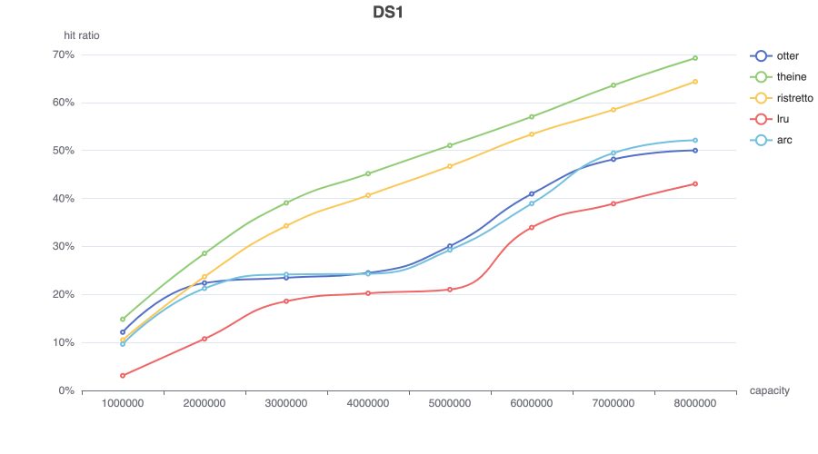

# Theine
[](https://codecov.io/gh/Yiling-J/theine-go)

High performance in-memory cache inspired by [Caffeine](https://github.com/ben-manes/caffeine).


- Good performance
- Support for Generics
- High hit ratio with adaptive [W-TinyLFU](https://arxiv.org/pdf/1512.00727.pdf) eviction policy
- Expired data are removed automatically using [hierarchical timer wheel](http://www.cs.columbia.edu/~nahum/w6998/papers/ton97-timing-wheels.pdf)

  > TTL must be considered in in-memory caching because
it limits the effective (unexpired) working set size. Efficiently removing expired objects from cache needs to be
prioritized over cache eviction. - [A large scale analysis of hundreds of in-memory
cache clusters at Twitter](https://www.usenix.org/system/files/osdi20-yang.pdf)
- Simple API

## Table of Contents

- [Requirements](#requirements)
- [Installation](#installation)
- [API](#api)
- [Cache Persistence](#cache-persistence)
- [Benchmarks](#benchmarks)
  * [throughput](#throughput)
  * [hit ratios](#hit-ratios)
- [Support](#support)

## Requirements
Go 1.19+

## Installation
```
go get github.com/Yiling-J/theine-go
```

## API

**Builder API**

Theine provides two types of client, simple cache and loading cache. Both of them are initialized from a builder. The difference between simple cache and loading cache is: loading cache's Get method will compute the value using loader function when there is a miss, while simple cache client only return false and do nothing.

Loading cache uses [singleflight](https://pkg.go.dev/golang.org/x/sync/singleflight) to prevent concurrent loading to same key(thundering herd).

simple cache:

```GO
import "github.com/Yiling-J/theine-go"

// key type string, value type string, max size 1000
// max size is the only required configuration to build a client
client, err := theine.NewBuilder[string, string](1000).Build()
if err != nil {
	panic(err)
}

// builder also provide several optional configurations
// you can chain them together and call build once
// client, err := theine.NewBuilder[string, string](1000).Cost(...).Doorkeeper(...).Build()

// or create builder first
builder := theine.NewBuilder[string, string](1000)

// dynamic cost function based on value
// use 0 in Set will call this function to evaluate cost at runtime
builder.Cost(func(v string) int64 {
		return int64(len(v))
})

// doorkeeper
// doorkeeper will drop Set if they are not in bloomfilter yet
// this can improve write performance, but may lower hit ratio
builder.Doorkeeper(true)

// removal listener, this function will be called when entry is removed
// RemoveReason could be REMOVED/EVICTED/EXPIRED
// REMOVED: remove by API
// EVICTED: evicted by Window-TinyLFU policy
// EXPIRED: expired by timing wheel
builder.RemovalListener(func(key K, value V, reason theine.RemoveReason) {})

```
loading cache:

```go
import "github.com/Yiling-J/theine-go"

// loader function: func(ctx context.Context, key K) (theine.Loaded[V], error)
// Loaded struct should include cache value, cost and ttl, which required by Set method
client, err := theine.NewBuilder[string, string](1000).BuildWithLoader(
	func(ctx context.Context, key string) (theine.Loaded[string], error) {
		return theine.Loaded[string]{Value: key, Cost: 1, TTL: 0}, nil
	},
)
if err != nil {
	panic(err)
}

```
Other builder options are same as simple cache(cost, doorkeeper, removal listener).


**Client API**

```Go
// set, key foo, value bar, cost 1
// success will be false if cost > max size
success := client.Set("foo", "bar", 1)
// cost 0 means using dynamic cost function
// success := client.Set("foo", "bar", 0)

// set with ttl
success = client.SetWithTTL("foo", "bar", 1, 1*time.Second)

// get(simple cache version)
value, ok := client.Get("foo")

// get(loading cache version)
value, err := client.Get(ctx, "foo")

// remove
client.Delete("foo")

// iterate key/value in cache and apply custom function
// if function returns false, range stops the iteration
client.Range(func(key, value int) bool {
	return true
})

// close client, set hashmaps in shard to nil and close all goroutines
client.Close()

```
## Cache Persistence
Theine supports persisting the cache into `io.Writer` and restoring from `io.Reader`. [Gob](https://pkg.go.dev/encoding/gob) is used to encode/decode data, so **make sure your key/value can be encoded by gob correctly first** before using this feature.

#### API
```go
func (c *Cache[K, V]) SaveCache(version uint64, writer io.Writer) error
func (c *Cache[K, V]) LoadCache(version uint64, reader io.Reader) error
```
**- Important:** please `LoadCache` immediately after client created or TTL may broken!

#### Example:
```go
// save
f, err := os.Create("test")
err := client.SaveCache(0, f)
f.Close()

// load
f, err = os.Open("test")
require.Nil(t, err)
newClient, err := theine.NewBuilder[int, int](100).Build()
// load immediately after client created
err = newClient.LoadCache(0, f)
f.Close()
```
Version number must be same when saving and loading, or `LoadCache` will return `theine.VersionMismatch` error. You can change the version number when you want to ignore persisted cache.
```go
err := newClient.LoadCache(1, f)
// VersionMismatch is a global variable
if err == theine.VersionMismatch {
	// ignore and skip loading
} else if err != nil {
	// panic error
}
```

#### Details
When persisting cache, Theine roughly do:
- Store version number.
- Store clock(used in TTL).
- Store frequency sketch.
- Store entries one by one in protected LRU in most-recently:least-recently order.
- Store entries one by one in probation LRU in most-recently:least-recently order.
- Loop shards and store entries one by one in each shard deque.

When loading cache, Theine roughly do:
- Load version number, compare to current version number.
- Load clock.
- Load frequency sketch.
- Load protected LRU and insert entries back to new protected LRU and shards, expired entries will be ignored. Because cache capacity may change, this step will stop if max protected LRU size reached.
- Load probation LRU and insert entries back to new probation LRU and shards, expired entries will be ignored, Because cache capacity may change, this step will stop if max probation LRU size reached.
- Load deque entries and insert back to shards, expired entries will be ignored.

Theine will save checksum when persisting cache and verify checksum first when loading.

## Benchmarks

Source: https://github.com/Yiling-J/go-cache-benchmark-plus

This repo includes reproducible throughput/hit-ratios benchmark code, you can also test your own cache package with it.
	
### throughput

```
goos: darwin
goarch: amd64
pkg: github.com/Yiling-J/go-cache-benchmark-plus
cpu: Intel(R) Core(TM) i7-9750H CPU @ 2.60GHz
BenchmarkGetParallel/theine-12          40604346                28.72 ns/op            0 B/op          0 allocs/op
BenchmarkGetParallel/ristretto-12       60166238                23.50 ns/op           17 B/op          1 allocs/op
BenchmarkSetParallel/theine-12          16067138                67.55 ns/op            0 B/op          0 allocs/op
BenchmarkSetParallel/ristretto-12       12830085                79.30 ns/op          116 B/op          3 allocs/op
BenchmarkZipfParallel/theine-12         15908767                70.07 ns/op            0 B/op          0 allocs/op
BenchmarkZipfParallel/ristretto-12      17200935                80.05 ns/op          100 B/op          3 allocs/op
```

### hit ratios

ristretto v0.1.1: https://github.com/dgraph-io/ristretto
> from Ristretto [README](https://github.com/dgraph-io/ristretto#hit-ratios), the hit ratio should be higher. But I can't reproduce their benchmark results. So I open an issue: https://github.com/dgraph-io/ristretto/issues/336

golang-lru v2.0.2: https://github.com/hashicorp/golang-lru

**zipf**


**search**

This trace is described as "disk read accesses initiated by a large commercial search engine in response to various web search requests."


**database**

This trace is described as "a database server running at a commercial site running an ERP application on top of a commercial database."


**Scarabresearch database trace**

Scarabresearch 1 hour database trace from this [issue](https://github.com/ben-manes/caffeine/issues/106)


**Meta anonymized trace**

Meta shared anonymized trace captured from large scale production cache services, from [cachelib](https://cachelib.org/docs/Cache_Library_User_Guides/Cachebench_FB_HW_eval/#running-cachebench-with-the-trace-workload)


## Support
Open an issue, ask question in discussions or join discord channel: https://discord.gg/StrgfPaQqE 
