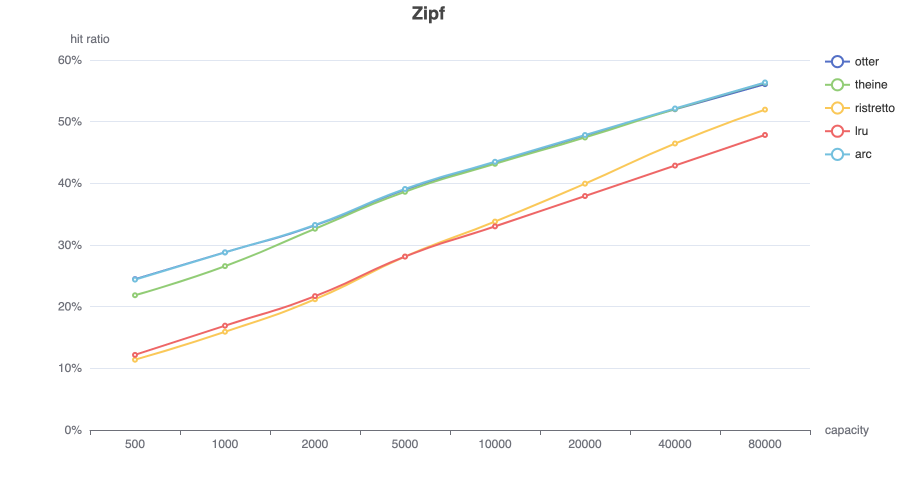

# WIP

```
BenchmarkGetTheineParallel-12           32432190                36.39 ns/op            0 B/op          0 allocs/op
BenchmarkGetRistrettoParallel-12        63978058                18.86 ns/op           17 B/op          1 allocs/op
BenchmarkSetTheineParallel-12           20791834                84.49 ns/op            0 B/op          0 allocs/op
BenchmarkSetRistrettoParallel-12        23354626                65.53 ns/op          116 B/op          3 allocs/op
BenchmarkZipfTheineParallel-12          14771362                74.72 ns/op            1 B/op          0 allocs/op
BenchmarkZipfRistrettoParallel-12       21031435                61.82 ns/op          100 B/op          3 allocs/op
```

**zipf**


**search**

This trace is described as "disk read accesses initiated by a large commercial search engine in response to various web search requests."

**database**

This trace is described as "a database server running at a commercial site running an ERP application on top of a commercial database."

**Scarabresearch database trace**

Scarabresearch 1 hour database trace from this [issue](https://github.com/ben-manes/caffeine/issues/106)

**Meta anonymized trace**

Meta shared anonymized trace captured from large scale production cache services, from [cachelib](https://cachelib.org/docs/Cache_Library_User_Guides/Cachebench_FB_HW_eval/#running-cachebench-with-the-trace-workload)

